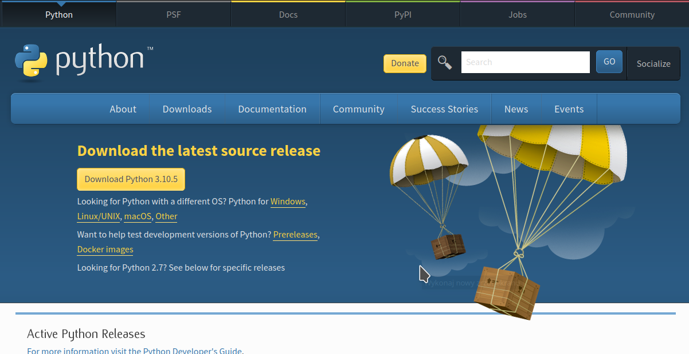
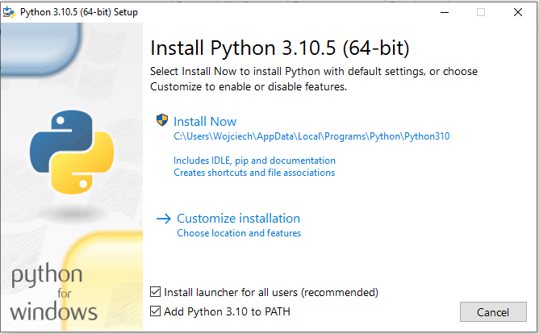
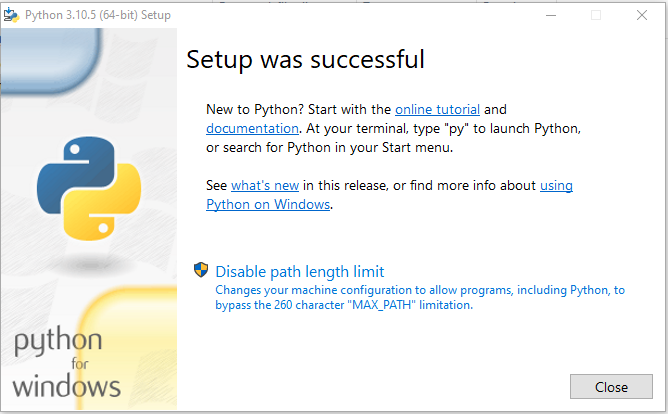
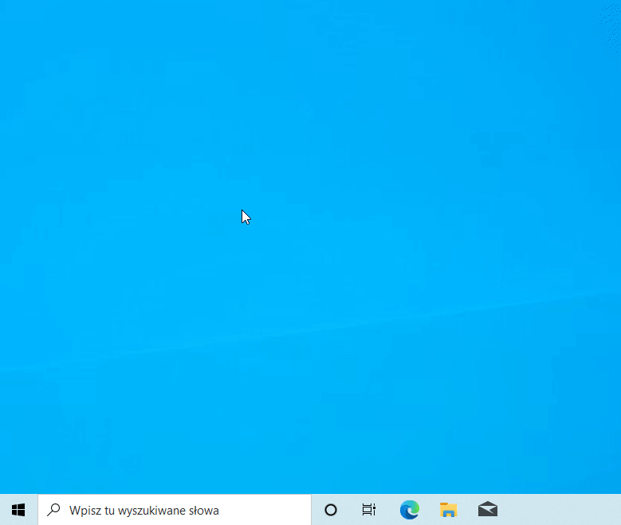
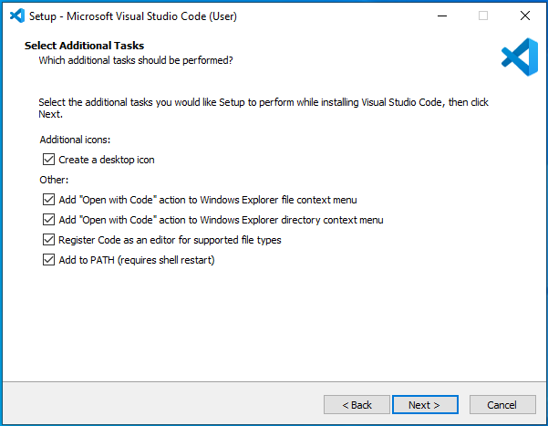
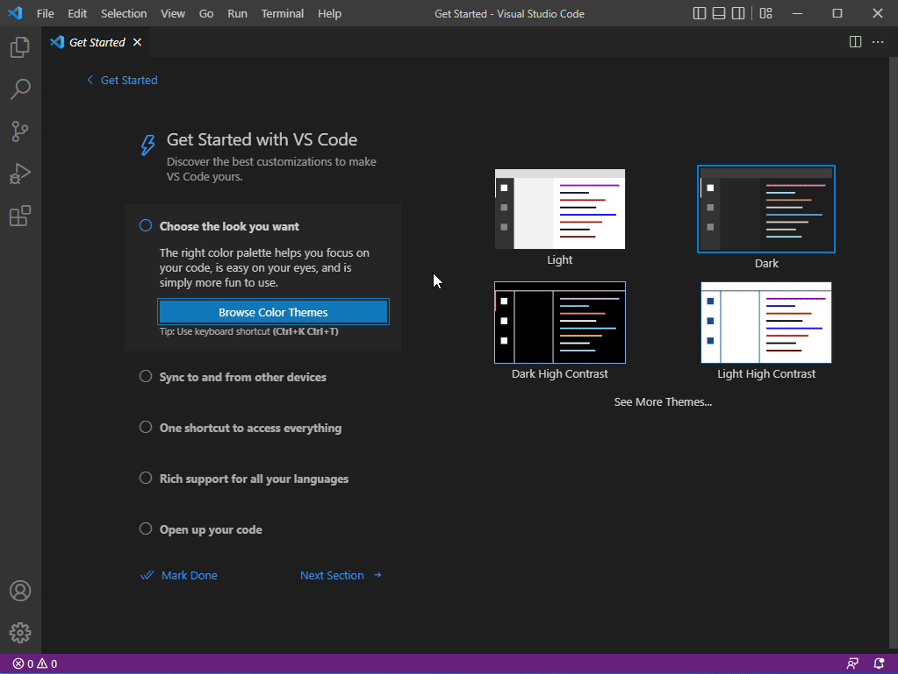

# Warsztaty z podstaw programowania
Witaj! Na tej stronie dowiesz się jak przygotować swój komputer do zajęć. Wykonaj proszę uważnie wszystkie poniższe kroki, a w razie problemów nie wahaj się poprosić o pomoc! Możesz wysyłać swoje pytania na Discordzie lub na mojego maila.

Powodzenia i do zobaczenia!
Wojtek

## Discord

Zacznij od dołączenia do serwera Discord, abyś mógł/mogła zadawać pytania w razie problemów.
Jeśli nie posiadasz Discorda, zainstaluj go oraz załóż konto zgodnie z instrukcją [na TEJ stronie](https://support.discord.com/hc/pl/articles/360034561191-Instalacja).

Aby dołączyć do serwera, uruchom aplikację Discord, a następnie kliknij na link: [https://discord.gg/X4bKCwSPZu](https://discord.gg/X4bKCwSPZu)

## Instalacja środowiska Python

Teraz przechodzimy do najważniejszego etapu - instalacji języka Python na naszym komputerze. Wykonuj poniższe kroki bardzo uważnie, zwracając uwagę na zaznaczane opcje instalacji - to bardzo ważne!

Przejdź na stronę [https://www.python.org/downloads/](https://www.python.org/downloads/), a następnie kliknij przycisk **"Download Python 3.10.5"**. Numer wersji może się różnić w zależności od tego, kiedy wykonujesz tę instrukcję - nie przejmuj się tym i pobierz mimo to.

Uruchom pobrany instalator. W pierwszym oknie **upewnij się, że pole "Add Python 3.10 to PATH" jest zaznaczone!** Następnie wybierz opcję **Install Now**.

Jeśli pojawi się okno z pytaniem "Czy chcesz zezwolić tej aplikacji na wprowadzanie zmian na tym urządzeniu?" - wybierz opcję **Tak**. 
Poczekaj na zakończenie instalacji. W kolejnym oknie kliknij opcję **"Disable path length limit"**.

Na koniec kliknij **"Close"**.

W tym momencie Python powinien już być zainstalowany. Aby to sprawdzić, otwórz menu Start, wpisz **cmd** i wciśnij Enter. Powinno pojawić się okno Wiersza Poleceń. Wpisz `python --version` i wciśnij Enter. 

Jeśli pojawi się linijka z prawidłową wersją Pythona - przejdź do kolejnej części. Jeśli nie, usuń i zainstaluj Pythona ponownie, zwracając uwagę na szczegóły podane powyżej.

## Instalacja edytora

Następnie zainstalujemy edytor Visual Studio Code, którego będziemy używać do pisania kodu oraz uruchamiania naszych programów.

Przejdź na stronę [https://code.visualstudio.com/download](https://code.visualstudio.com/download) i pobierz wersję dla systemu Windows. Po pobraniu uruchom instalator.

W pierwszym oknie wybierz język angielski, a w następnym zaznacz opcję **I accept the agreement** i kliknij **Next >**.

Kliknij **Next >** dwukrotnie, aż dotrzesz do okna **Select Additional Tasks**. Zaznacz w nim wszystkie dostępne opcje.

Kliknij **Next >**, w kolejnym oknie **Install** i poczekaj na zakończenie instalacji. Po instalacji program Visual Studio Code powinien się uruchomić automatycznie. Jeśli nie, uruchom go skrótem na pulpicie.

Ostatnia rzecz jaka nam została to instalacja odpowiednich rozszerzeń do VS Code. Po lewej stronie okna kliknij przycisk **Extensions**, wpisz **python** i wybierz oraz zainstaluj rozszerzenie **Python Extension Pack** jak na filmie poniżej:

**To wszystko! Jeśli udało Ci się wykonać tę instrukcję, pochwal się proszę na Discordzie lub mailem :)**